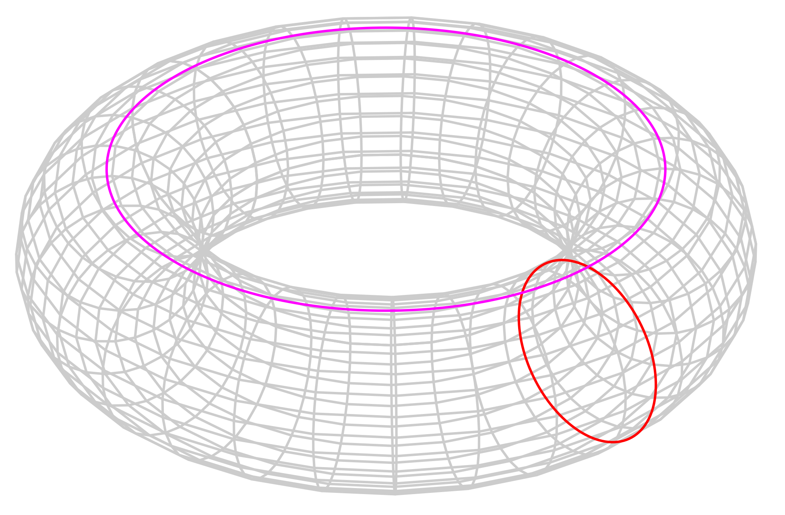

# Torus Traveller



# Rules:

## 1. Basic Movement:
- Rover operates on a grid of arbitrary size that wraps North/South and East/West ("asteroids" style)
- Accepts three commands:
  - Move (exclusively forwards)
  - Rotate (clockwise)
  - Rotate (counter-clockwise)

 
## 2. Autopilot:
- a) Determine shortest path from any given grid coors to any other
- b) Improve solution to include non-traversable terrain
 

# Considerations:
- Rover:
  - immutable, should spawn a new bot rather than mutating itself when performing.
    - (Personally, I like to imagine it builds a new rover, pads it on the head, then self-destructs)
- Grid 
  - Immutable
  - is always square (`$SIZE x $SIZE`)
  - is (like all good data structures) `0`-indexed 
  - "inverted" Y axis (top is `0`, bottom is `$SIZE - 1`); example grid coords when $SIZE == 4:
```text
(0,0), (1,0), (2,0), (3,0)
(0,1), (1,1), (2,1), (3,1)
(0,2), (1,2), (2,2), (3,2)
(0,3), (1,3), (2,3), (3,3)
```


## Dependencies:
- Scalatest